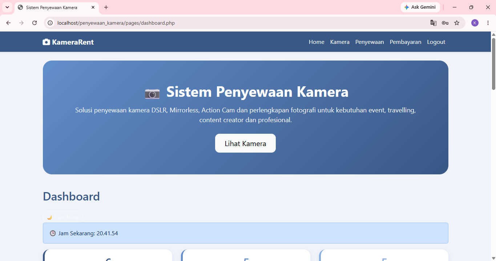
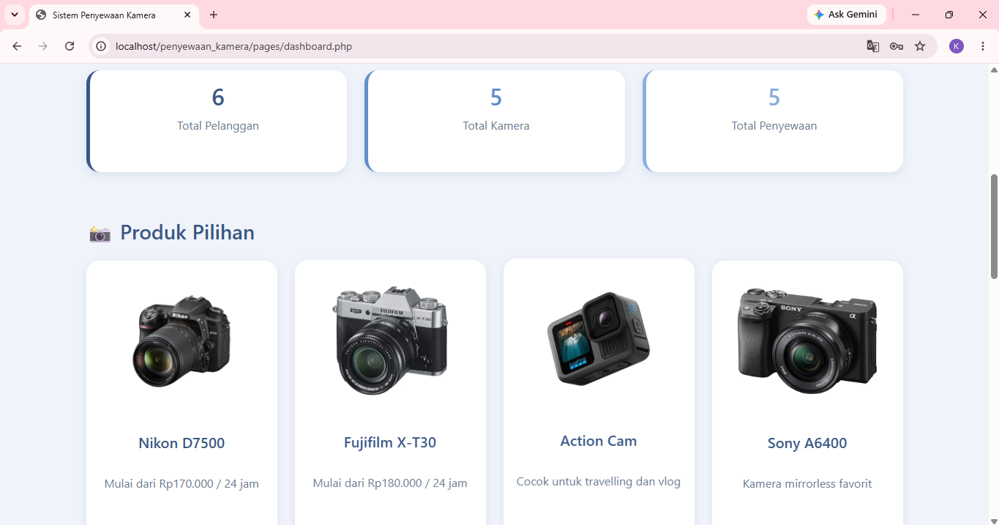
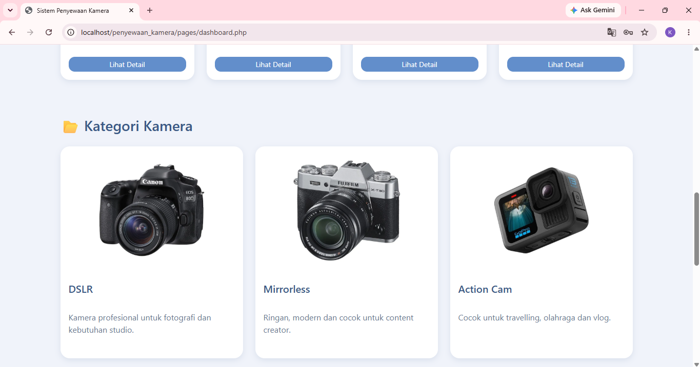
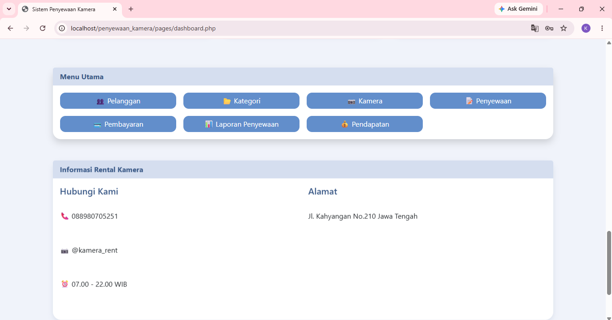
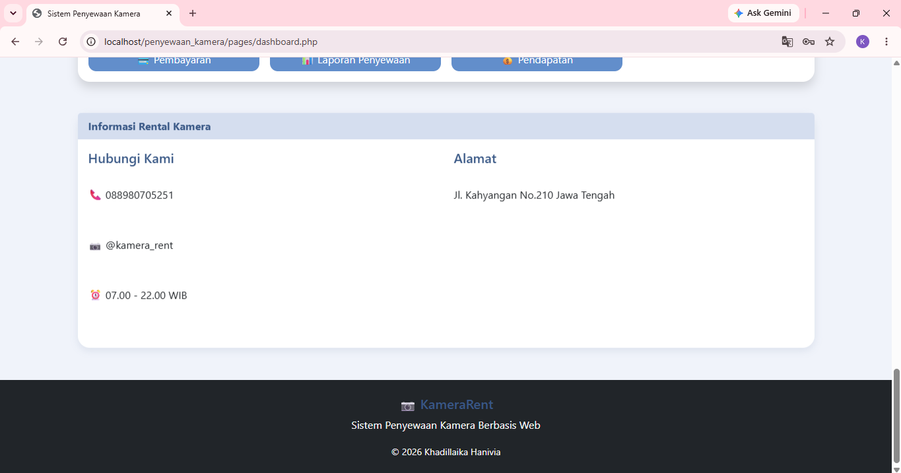
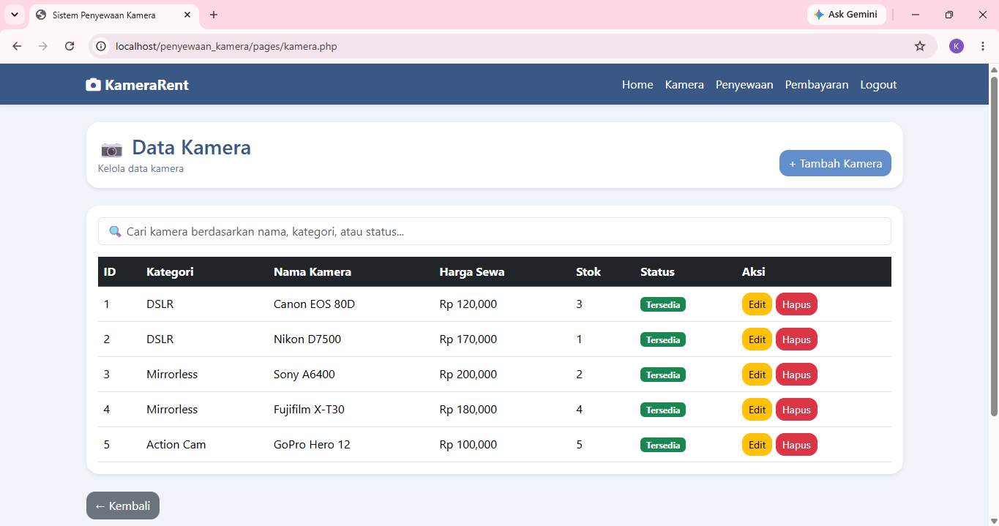
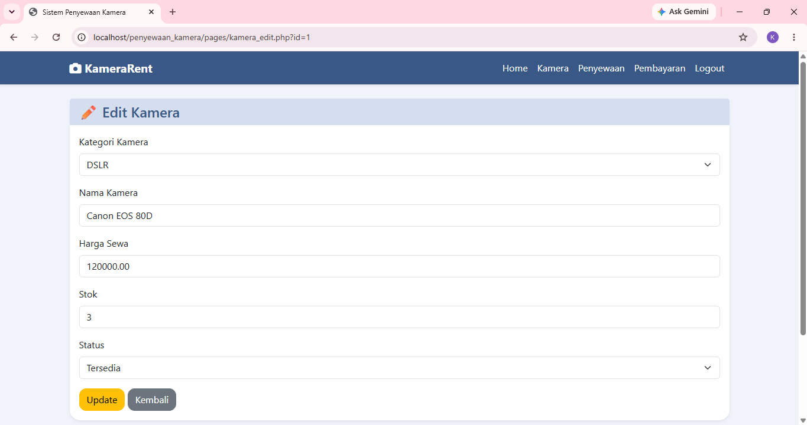
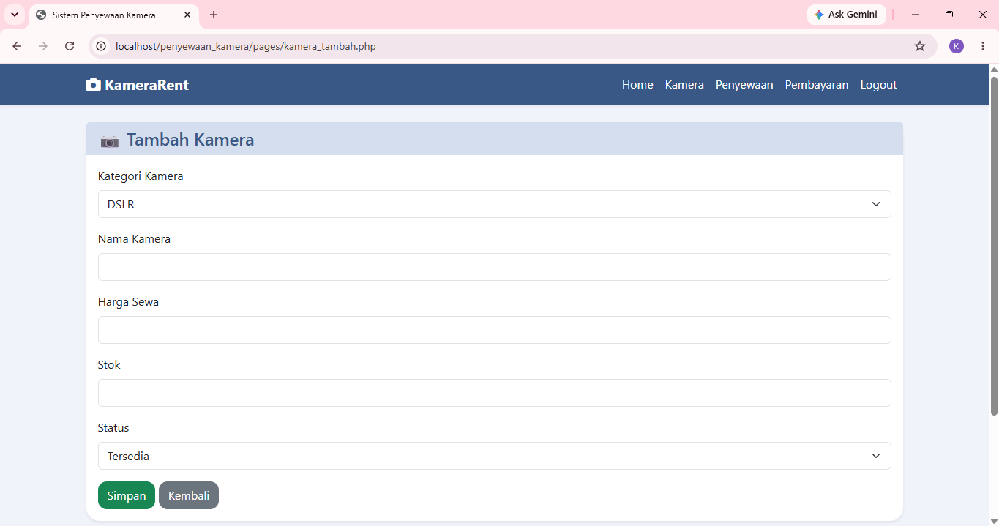
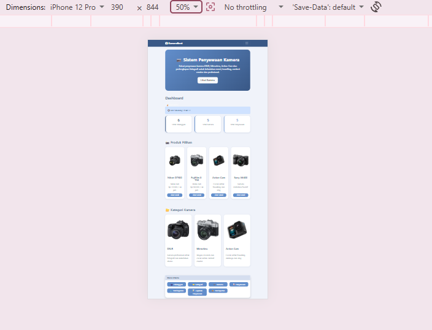
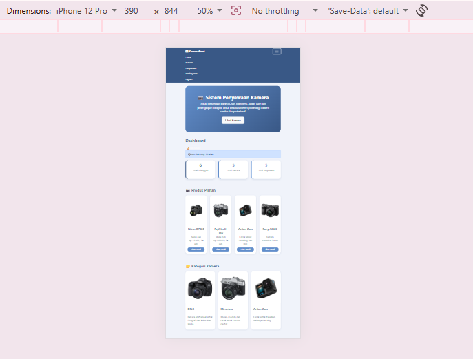

# Sistem Penyewaan Kamera

## Deskripsi Proyek

Sistem Penyewaan Kamera adalah aplikasi berbasis web yang digunakan untuk mengelola proses penyewaan kamera secara terintegrasi. Aplikasi ini mencakup pengelolaan data pelanggan, kategori kamera, data kamera, transaksi penyewaan, pembayaran, serta laporan penyewaan dan pendapatan.

Proyek ini dikembangkan sebagai Final Project Praktikum Pemrograman Web 1 dan Praktikum Basis Data.

---

## Teknologi yang Digunakan

* PHP Native
* MySQL
* Bootstrap 5
* JavaScript
* Laragon
* phpMyAdmin

---

## Fitur Aplikasi

### Dashboard

* Statistik jumlah pelanggan
* Statistik jumlah kamera
* Statistik jumlah penyewaan
* Jam digital menggunakan JavaScript

### Manajemen Data (CRUD)

* CRUD Pelanggan
* CRUD Kategori Kamera
* CRUD Kamera
* CRUD Penyewaan
* CRUD Pembayaran

### Sistem Login

* Login Admin
* Logout Admin
* Session Login (`session_start()`)

### Interaktivitas JavaScript

* Validasi form tambah kamera
* Pencarian kamera secara realtime
* Konfirmasi penghapusan data

### Laporan

* Laporan Penyewaan
* Laporan Pendapatan

---

## Struktur Database

Database menggunakan tabel:

1. pelanggan
2. kategori_kamera
3. kamera
4. penyewaan
5. detail_penyewaan
6. pembayaran
7. admin

---

## Implementasi Basis Data

### Query Complex

1. JOIN beberapa tabel untuk menampilkan data penyewaan lengkap.
2. Subquery untuk mencari kamera dengan harga sewa tertinggi.
3. Aggregate Function dan GROUP BY untuk menghitung jumlah penyewaan pelanggan.

### View

1. view_data_penyewaan
2. view_laporan_pendapatan

### Function

1. hitung_lama_sewa()
2. hitung_total_biaya()

### Trigger

1. trg_kurangi_stok
2. trg_status_kamera

---

## Keamanan dan Kualitas Kode

* Session Login menggunakan `session_start()`
* Validasi Form dengan JavaScript
* Struktur kode terpisah menggunakan:

  * config.php
  * header.php
  * footer.php
* Antarmuka responsif menggunakan Bootstrap 5

---

## Cara Menjalankan Proyek

1. Jalankan Laragon.

2. Import database `penyewaan_kamera.sql` ke phpMyAdmin.

3. Pastikan database bernama `penyewaan_kamera`.

4. Simpan project pada folder:

   C:\laragon\www\penyewaan_kamera

5. Jalankan melalui browser:

   http://localhost/penyewaan_kamera

6. Login Admin:

   Username: admin

   Password: admin123

---

## Screenshot Aplikasi

### Dashboard

### Data Kamera

### Edit Kamera

### Tambah Kamera

### Tampilan Mobile

---

## Video Demo

https://drive.google.com/drive/folders/1BKmb96QhCLmTP5tfyuWVe2jZJA2sSTG8?usp=sharing

---

## Author

Nama : Khadillaika Hanivia

NIM : 25/566994/SV/27138

Mata Kuliah : Praktikum Pemrograman Web 1 dan Praktikum Basis Data